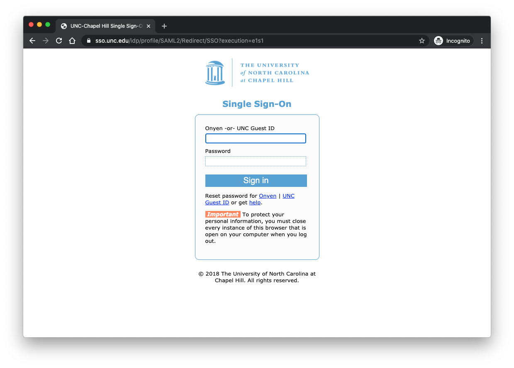
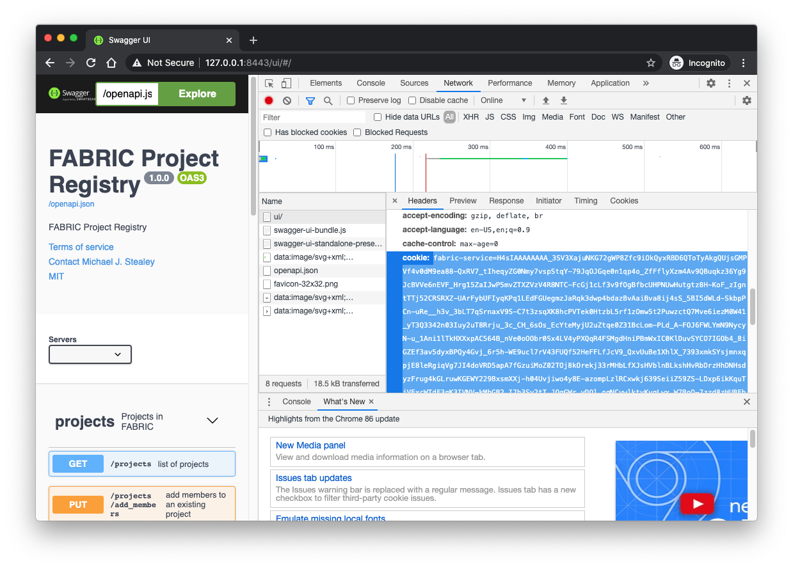

# Project Registry

Python (Flask) based ReSTful API service for FABRIC Project Registry management

## Table of Contents

- [About](#about)
- [Usage](#usage) 
  - [Prerequisites](#prereq)
  - [Configuration](#config)
  - [Development](#devdeploy)
  - [Production](#proddeploy)
- [API Specification](#apispec)
  - [API Version](#apiversion)
  - [API People](#apipeople)
  - [API Projects](#apiprojects)
- [How to contribute](#contrib)
- [References](#references)

## <a name="about"></a>About

The Project Registry manages FABRIC project creation and membership via a REST API. Recorded project information is a combination of CILogon/COmanage identity and authorization attributes along with internal meta-information about each project. 

Current project membership and roles are maintained and asserted via COmanage. COmanage data represents the roles (groups or permissions) an individual would have within the scope of one or more projects within FABRIC.

The Project Registry also maintains a separate persistent database of projects storing meta-information about each project (e.g. description, purpose) and maintaining a log of actions for each project. COmanage is treated as the single source of "truth" and then augmented by project meta-information which is stored to a separate persistent database. COmanage information is continuously monitored such that no role based project level decision is made without first verifying identity and role via COmanage.

The principal policies guiding the development of the project registry are documented in [fabric-testbed/Authz](https://github.com/fabric-testbed/Authz/tree/master/policies)

The Project Registry is a ReSTful (Representational State Transfer) service implementation using Swagger tooling to define the API specification using the OpenAPI specification.

**What Is OpenAPI?**

OpenAPI Specification (formerly Swagger Specification) is an API description format for REST APIs. An OpenAPI file allows you to describe your entire API, including:

- Available endpoints (/users) and operations on each endpoint (GET /users, POST /users)
- Operation parameters Input and output for each operation
- Authentication methods
- Contact information, license, terms of use and other information.

API specifications can be written in YAML or JSON. The format is easy to learn and readable to both humans and machines. The complete OpenAPI Specification can be found on GitHub: OpenAPI 3.0 Specification

**What Is Swagger?**

Swagger is a set of open-source tools built around the OpenAPI Specification that can help you design, build, document and consume REST APIs. The major Swagger tools include:

- Swagger Editor – browser-based editor where you can write OpenAPI specs.
- Swagger UI – renders OpenAPI specs as interactive API documentation.
- Swagger Codegen – generates server stubs and client libraries from an OpenAPI spec.

## <a name="usage"></a>Usage

### <a name="prereq"></a>Prerequisites

There are a minimal number of prerequisites to run the code herein. Development of this code is done primarily on macOS, and as such some of the development scripts will be relying on the following requirements.

- Docker
- Docker Compose
- Python3 / Pip3
- Virtualenv

### <a name="config"></a>Configuration

Configuration settings are managed in a few key places

**config.ini** (api server settings)

- Create the `server/swagger_server/config/config.ini` file by copying the `server/swagger_server/config/config.ini_template` template file
- Adjust the settings to suit your deployment environment
    - `mock.data` - use True unless you have COmanage LDAP access (default `True`)
    - `mock.comanage_api` - use True unless you have COmanage LDAP access (default `True`)
    - `postgres.host` - use `database` when deploying api-server in docker (default `database`)
    - `ldap.host` - Value provided by CILogon staff (default to empty)
    - `ldap.user` - Value provided by CILogon staff (default to empty)
    - `ldap.password` - Value provided by CILogon staff (default to empty)
    - `ldap.search_base` - Value provided by CILogon staff (default to empty)
- Provided example template:

    ```ini
    ; mock - Mock data flags
    [mock]
    ; True = use mock data instead of data found in COmanage
    data = True
    ; True = use mock api calls to COmanage (does not create real groups)
    comanage_api = True
    
    ; cou - COmanaage non-project COUs for authorization checks
    [cou]
    fabric_active_users = CO:COU:fabric-active-users:members:active
    facility_operators = CO:COU:facility-operators:members:active
    project_leads = CO:COU:project-leads:members:active
    
    ; postgres - PostgreSQL database settings
    [postgres]
    ; use for docker based server
    host = database
    ; use for locally running server
    ;host = 127.0.0.1
    port = 5432
    database = postgres
    user = postgres
    password = registry
    
    ; ldap - COmanage LDAP settings provided by CILogon staff
    [ldap]
    host =
    user =
    password =
    search_base =
    
    ; default-user - Default user settings for when user credentials are not found in the header
    [default-user]
    uuid = 00000000-0000-0000-0000-000000000000
    oidc_claim_sub = http://cilogon.org/serverA/users/000000
    name = anonymous user
    email = anonymous@fabric-testbed.net
    eppn = anonymous@fabric-testbed.net
    ; roles must be space delimited if providing more than one
    roles = CO:COU:fabric-active-users:members:active
    
    ; uwsgi - uWSGI settings
    [uwsgi]
    ; documentation: http://uwsgi-docs.readthedocs.io/en/latest/Options.html
    ; force the specified protocol for default sockets
    protocol = http
    ; spawn the specified number of workers/processes
    processes = 2
    ; run each worker in prethreaded mode with the specified number of threads
    threads = 2
    ; chdir to specified directory before apps loading
    chdir = ./
    ; load Django's WSGI file/module
    module = wsgi:app
    ; set PYTHONHOME/virtualenv (full path)
    ;virtualenv          = ./venv ;;; now set in run_uwsgi script
    ; enable master process
    master = true
    ; bind to the specified UNIX/TCP socket using default protocol
    socket = :5000
    ; add an http router/server on the specified address **port**
    ;http                = :8000
    ; map mountpoint to static directory (or file) **port**
    ;static-map          = /static/=static/
    ;static-map          = /media/=media/
    ; bind to the specified UNIX/TCP socket using uwsgi protocol (full path) **socket**
    ; uwsgi-socket        = ./base.sock
    ; chmod-socket ... with appropriate permissions - may be needed **socket**
    ; chmod-socket        = 666
    ; try to remove all of the generated file/sockets
    vacuum = true
    ; automatically transform output to chunked encoding during HTTP 1.1 keepalive
    ;http-auto-chunked = true
    ; HTTP 1.1 keepalive support (non-pipelined) requests
    ;http-keepalive = true
    ; load apps in each worker instead of the master
    ;lazy-apps = true
    ; strategy for allocating/deallocating the WSGI env
    ;wsgi-env-behavior = holy
    ; enable post buffering
    ;post-buffering = true
    ; prefix logs with date or a strftime string
    ;log-date = true
    ; reload workers after the specified amount of managed requests
    max-requests = 5000
    ; exit instead of brutal reload on SIGTERM (no more needed)
    die-on-term = true
    ```

**config** (vouch-proxy settings)

- Create the `vouch/config` file by copying the `vouch/config_template` template file

- Adjust the settings to suit your deployment environment
    - `vouch.publicAccess:` - set to false to enforce authentication (default `true`)
    - `cookie.domain:` - your domain (default `127.0.0.1`)
    - `cookie.name:` - your cookie name (default `fabric-service`)
    - `oauth.client_id:` - CILogon Client ID (default `CILOGON_CLIENT_ID`)
    - `oauth.client_secret:` - CILogon Client Secret (default `CILOGON_CLIENT_SECRET`)
    - `oauth.callback_url:` - OIDC callback URL (default `http://127.0.0.1:9090/auth`)
- Provided example template:

    ```yaml
    # vouch config
    # bare minimum to get vouch running with OpenID Connect (such as okta)
    
    vouch:
        logLevel: debug
        # domains:
        # valid domains that the jwt cookies can be set into
        # the callback_urls will be to these domains
        # domains:
        # - yourdomain.com
        # - yourotherdomain.com
    
        # - OR -
        # instead of setting specific domains you may prefer to allow all users...
        # set allowAllUsers: true to use Vouch Proxy to just accept anyone who can authenticate at the configured provider
        # and set vouch.cookie.domain to the domain you wish to protect
        allowAllUsers: true
    
        # Setting publicAccess: true will accept all requests, even without a valid jwt/cookie.  - VOUCH_PUBLICACCESS
        # If the user is logged in, the cookie will be validated and the user header will be set.
        # You will need to direct people to the Vouch Proxy login page from your application.
        publicAccess: true
    
        jwt:
            # secret - VOUCH_JWT_SECRET
            # a random string used to cryptographically sign the jwt
            # Vouch Proxy complains if the string is less than 44 characters (256 bits as 32 base64 bytes)
            # if the secret is not set here then Vouch Proxy will..
            # - look for the secret in `./config/secret`
            # - if `./config/secret` doesn't exist then randomly generate a secret and store it there
            # in order to run multiple instances of vouch on multiple servers (perhaps purely for validating the jwt),
            # you'll want them all to have the same secret
            secret: kmDDgMLGThapDV1QnhWPJd0oARzjLa5Zy3bQ8WfOIYk=
    
        cookie:
            # allow the jwt/cookie to be set into http://yourdomain.com (defaults to true, requiring https://yourdomain.com)
            secure: false
            # vouch.cookie.domain must be set when enabling allowAllUsers
            domain: 127.0.0.1
            name: fabric-service
    
        headers:
            jwt: X-Vouch-Token                # VOUCH_HEADERS_JWT
            querystring: access_token         # VOUCH_HEADERS_QUERYSTRING
            redirect: X-Vouch-Requested-URI   # VOUCH_HEADERS_REDIRECT
            claims:
                - aud
                - email
                - family_name
                - given_name
                - iss
                - name
                - oidc
                - sub
                - token_id
            idtoken: X-Vouch-IdP-IdToken
            accesstoken: X-Vouch-IdP-AccessToken
            # refresh token added to OIDC RP Client response by request to CILogon
            refreshtoken: X-Vouch-IdP-RefreshToken
    
    oauth:
        # Generic OpenID Connect
        # including okta
        provider: oidc
        client_id: CILOGON_CLIENT_ID
        client_secret: CILOGON_CLIENT_SECRET
        auth_url: https://cilogon.org/authorize
        token_url: https://cilogon.org/oauth2/token
        user_info_url: https://cilogon.org/oauth2/userinfo
        scopes:
            - openid
            - email
            - profile
        callback_url: http://127.0.0.1:9090/auth
    ```

### <a name="devdeploy"></a>Development


A series of scripts have been created to automate common deployment activities and reside within the `scripts` directory.

```console
$ tree -L 1 scripts
scripts
├── README.md                     # Description of each script
├── run-local-database.sh         # Helper script to launch database
├── run-local-docker-server.sh    # Run using docker for all components
├── run-local-flask-server.sh     # Run using Flask development server
├── run-local-uwsgi-server.sh     # Run using uWSGI server
├── run-local-vouch-proxy.sh      # Helper script to launch Vouch-Proxy and Nginx
└── update-swagger-stub.sh        # Format new python-flask export from swagger
```

Detailed use for each can be found in the [README located in the scripts directory](./scripts)

**Example**: using `run-local-docker-server.sh`

From the `scripts` directory, execute the script named `run-local-docker-server.sh`

```console
$ ./run-local-docker-server.sh
Creating network "project-registry_default" with the default driver
Pulling database (library/postgres:12)...
12: Pulling from library/postgres
bb79b6b2107f: Pull complete
...
Digest: sha256:a1e04460fdd3c338d6b65a2ab66b5aa2748eb18da3e55bcdc9ef17831ed3ad46
Status: Downloaded newer image for postgres:12
Creating pr-database ... done
Pulling nginx (library/nginx:1)...
1: Pulling from library/nginx
bb79b6b2107f: Already exists
5a9f1c0027a7: Pull complete
...
Digest: sha256:aeade65e99e5d5e7ce162833636f692354c227ff438556e5f3ed0335b7cc2f1b
Status: Downloaded newer image for nginx:1
Pulling vouch-proxy (voucher/vouch-proxy:)...
latest: Pulling from voucher/vouch-proxy
94b911a45bc9: Pull complete
...
Digest: sha256:86689d8d0423bea9658c53834104f995d259b83fc0cc506ae719a53bc01a4888
Status: Downloaded newer image for voucher/vouch-proxy:latest
Creating pr-nginx       ... done
Creating pr-vouch-proxy ... done
[INFO] run development server in docker
Pulling nginx       ... done
Pulling database    ... done
Pulling api-server  ... done
Pulling vouch-proxy ... done
nginx uses an image, skipping
database uses an image, skipping
vouch-proxy uses an image, skipping
Building api-server
Step 1/9 : FROM python:3
3: Pulling from library/python
e4c3d3e4f7b0: Pull complete
...
Digest: sha256:a92277812574a36601064c2863e19185989a0348fe9554a236f2b7cbe69d7fd0
Status: Downloaded newer image for python:3
 ---> 768307cdb962
Step 2/9 : MAINTAINER Michael J. Stealey <michael.j.stealey@gmail.com>
 ---> Running in 307bde878a6b
Removing intermediate container 307bde878a6b
...
Step 9/9 : CMD ["run_server"]
 ---> Running in 34643571c59c
Removing intermediate container 34643571c59c
 ---> 20ba5436b262

Successfully built 20ba5436b262
Successfully tagged project-registry_api-server:latest
pr-database is up-to-date
pr-nginx is up-to-date
Creating pr-api-server ... done
[INFO] waiting for server to start up
1 ...
['mock', 'cou', 'postgres', 'ldap', 'default-user', 'uwsgi']
[INFO] tables created successfully!
['mock', 'cou', 'postgres', 'ldap', 'default-user', 'uwsgi']
[INFO] attempt to load version data
[INFO] data loaded successfully!
[INFO] get COmanage cou list
[INFO] cou objects found
cn: CO:admins
cn: CO:members:all
cn: CO:members:active
cn: CO:COU:metrics:admins
cn: CO:COU:Jupyterhub:admins
cn: CO:COU:metrics:members:all
cn: CO:COU:Jupyterhub:members:all
cn: CO:COU:metrics:members:active
cn: CO:COU:jenkinscicd:members:all
cn: CO:COU:Jupyterhub:members:active
cn: CO:COU:project-leads:members:all
cn: CO:COU:jenkinscicd:members:active
cn: CO:COU:project-leads:members:active
cn: CO:COU:facility-operators:members:all
cn: CO:COU:facility-operators:members:active
[INFO] cou objects returned
['CO:COU:project-leads:members:active',
 'CO:COU:facility-operators:members:active']
[INFO] attempt to load project data
[INFO] data loaded successfully!
[INFO] get COmanage people list
[INFO] people objects found
       -----------------
cn: Michael J. Stealey
eduPersonPrincipalName: stealey@unc.edu
isMemberOf: ['CO:members:all', 'CO:members:active', 'CO:admins', 'CO:COU:Jupyterhub:admins', 'CO:COU:Jupyterhub:members:active', 'CO:COU:Jupyterhub:members:all', 'CO:COU:jenkinscicd:members:active', 'CO:COU:jenkinscicd:members:all', 'CO:COU:facility-operators:members:active', 'CO:COU:facility-operators:members:all', 'CO:COU:project-leads:members:active', 'CO:COU:project-leads:members:all']
mail: stealey@unc.edu
uid: http://cilogon.org/serverA/users/242181
       -----------------
cn: Erica Fu
eduPersonPrincipalName: ericafu@unc.edu
isMemberOf: ['CO:members:all', 'CO:members:active', 'CO:admins', 'CO:COU:Jupyterhub:admins', 'CO:COU:Jupyterhub:members:active', 'CO:COU:Jupyterhub:members:all']
mail: ericafu@renci.org
uid: http://cilogon.org/serverT/users/15045893
       -----------------
cn: Komal Thareja
eduPersonPrincipalName: kthare10@unc.edu
isMemberOf: ['CO:members:all', 'CO:members:active', 'CO:admins', 'CO:COU:Jupyterhub:admins', 'CO:COU:Jupyterhub:members:active', 'CO:COU:Jupyterhub:members:all', 'CO:COU:project-leads:members:active', 'CO:COU:project-leads:members:all']
mail: kthare10@email.unc.edu
uid: http://cilogon.org/serverA/users/11904101
       -----------------
cn: Yaxue Guo
eduPersonPrincipalName: yaxue@unc.edu
isMemberOf: ['CO:members:all', 'CO:members:active', 'CO:admins']
mail: yaxueguo@renci.org
uid: http://cilogon.org/serverT/users/26542073
       -----------------
cn: Charles Carpenter
eduPersonPrincipalName: cscarp0@uky.edu
isMemberOf: ['CO:members:all', 'CO:members:active', 'CO:admins', 'CO:COU:metrics:admins', 'CO:COU:metrics:members:active', 'CO:COU:metrics:members:all']
mail: cscarp0@g.uky.edu
uid: http://cilogon.org/serverA/users/15626041
[INFO] people objects returned
[{'cn': 'anonymous user',
  'eduPersonPrincipalName': 'anonymous@fabric-testbed.net',
  'isMemberOf': ['CO:COU:fabric-active-users:members:active'],
  'mail': 'anonymous@fabric-testbed.net',
  'uid': 'http://cilogon.org/serverA/users/000000'},
 {'cn': 'Michael J. Stealey',
  'eduPersonPrincipalName': 'stealey@unc.edu',
  'isMemberOf': ['CO:COU:facility-operators:members:active',
                 'CO:COU:project-leads:members:active'],
  'mail': 'stealey@unc.edu',
  'uid': 'http://cilogon.org/serverA/users/242181'},
 {'cn': 'Erica Fu',
  'eduPersonPrincipalName': 'ericafu@unc.edu',
  'isMemberOf': [],
  'mail': 'ericafu@renci.org',
  'uid': 'http://cilogon.org/serverT/users/15045893'},
 {'cn': 'Komal Thareja',
  'eduPersonPrincipalName': 'kthare10@unc.edu',
  'isMemberOf': ['CO:COU:project-leads:members:active'],
  'mail': 'kthare10@email.unc.edu',
  'uid': 'http://cilogon.org/serverA/users/11904101'},
 {'cn': 'Yaxue Guo',
  'eduPersonPrincipalName': 'yaxue@unc.edu',
  'isMemberOf': [],
  'mail': 'yaxueguo@renci.org',
  'uid': 'http://cilogon.org/serverT/users/26542073'},
 {'cn': 'Charles Carpenter',
  'eduPersonPrincipalName': 'cscarp0@uky.edu',
  'isMemberOf': [],
  'mail': 'cscarp0@g.uky.edu',
  'uid': 'http://cilogon.org/serverA/users/15626041'}]
[INFO] attempt to load people data
[INFO] data loaded successfully!
[INFO] attempt to load relationship data
[INFO] data loaded successfully!

[INFO] server running at: http://127.0.0.1:8080/ui/#/
[INFO] when finished terminate using command:
       ctrl-c               # to detach from container shell
       docker-compose stop  # to stop the running containers

[pid: 648|app: 0|req: 1/1] 172.18.0.5 () {48 vars in 3672 bytes} [Wed Nov 11 15:51:09 2020] GET /ui/favicon-32x32.png => generated 628 bytes in 8 msecs via sendfile() (HTTP/1.0 200) 7 headers in 268 bytes (0 switches on core 0)
[pid: 648|app: 0|req: 2/2] 172.18.0.5 () {52 vars in 3769 bytes} [Wed Nov 11 15:51:17 2020] GET /ui/ => generated 1437 bytes in 15 msecs (HTTP/1.0 200) 2 headers in 81 bytes (1 switches on core 1)
[pid: 649|app: 0|req: 1/3] 172.18.0.5 () {48 vars in 3634 bytes} [Wed Nov 11 15:51:17 2020] GET /ui/swagger-ui.css => generated 142839 bytes in 9 msecs via sendfile() (HTTP/1.0 200) 7 headers in 287 bytes (0 switches on core 0)
[pid: 648|app: 0|req: 3/4] 172.18.0.5 () {48 vars in 3672 bytes} [Wed Nov 11 15:51:17 2020] GET /ui/favicon-32x32.png => generated 628 bytes in 1 msecs via sendfile() (HTTP/1.0 200) 7 headers in 268 bytes (0 switches on core 0)
[pid: 649|app: 0|req: 2/5] 172.18.0.5 () {48 vars in 3623 bytes} [Wed Nov 11 15:51:17 2020] GET /openapi.json => generated 15451 bytes in 73 msecs (HTTP/1.0 200) 2 headers in 74 bytes (1 switches on core 1)
```

Upon completion the user will be notified that the service is running at [http://127.0.0.1:8080/ui/#/](), informed how to stop the service, and attached to `STDOUT` of the running api-server container

Navigate to [http://127.0.0.1:8080/ui/#/]() (user may be asked to accept the self-signed SSL certificates if using the example certs as http port 8080 will redirect to https port 8443)


Upon acceptance the user will be redirected to authenticate with the CILogon OIDC Client (assumes Vouch-Proxy config: `publicAccess: false`) 


Choose your Identity Provided from the federated drop down list



After successful authentication the user will be redirected to the api-servers UI


### <a name="proddeploy"></a>Production

TODO

## <a name="apispec"></a>API Specification

## Overview

The project registry enforces role based access as defined by the FABRIC COmanage registry.


### Terminology notes

`PROJECT_ID` as `uuid` - unique project identifier based on [uuid-4](https://docs.python.org/3/library/uuid.html) (e.g. `d505ea38-c409-42e7-833c-24843e8b0aed`)

`PEOPLE_ID` as `uuid` - unique people identifier based on [uuid-4](https://docs.python.org/3/library/uuid.html) (e.g. `ea806951-a22e-4e85-bc70-4ce74b1967b9`)

`OIDC_Claim_sub` - unique person identifier based on the CILogon `sub` attribute (e.g. `http://cilogon.org/serverA/users/123456`)

`ROLES` - roles can be global or project specific and determine the users ability to make API calls:

- Facility Operator (e.g. global: `CO:COU:facility-operators:members:active`)
- Project Lead (e.g. global: `CO:COU:project-leads:members:active`)
- Project Owner (e.g. project specific: `CO:COU:d505ea38-c409-42e7-833c-24843e8b0aed-po:members:active`)
- Project Member (e.g. project specific: `CO:COU:d505ea38-c409-42e7-833c-24843e8b0aed-pm:members:active`)

`Tags` - additional attributes applied at the project level and managed by the Facility Operator, for example:

- `peering`
- `cloudconnect`
- `fab-eu`
- `fab-apac`

`NA` - Not Applicable

**Parameter Types**

- OpenAPI 3.0 distinguishes between the following parameter types based on the parameter location. The location is determined by the parameter’s `in` key, for example, `in: query` or `in: path`.
  - [path parameters](https://swagger.io/docs/specification/describing-parameters/#path-parameters), such as `/users/{id}`
  - [query parameters](https://swagger.io/docs/specification/describing-parameters/#query-parameters), such as `/users?role=admin`
  - [header parameters](https://swagger.io/docs/specification/describing-parameters/#header-parameters), such as `X-MyHeader: Value`
  - [cookie parameters](https://swagger.io/docs/specification/describing-parameters/#cookie-parameters), which are passed in the `Cookie` header, such as `Cookie: debug=0; csrftoken=BUSe35dohU3O1MZvDCU`

### <a name="apiversion"></a>Version

The project registry API is versioned based on the release found in GitHub.

API `version`:

Resource | Action | Input | Output
:--------|:----:|:---:|:---:
`/version` | GET: current API version | NA | Version format

Example: Version format

```json
{
  "gitsha1": "Release SHA as string",
  "version": "Release version as string"
}
```

### <a name="apipeople"></a>People

People are identities as authenticated by CILogon/COmanage and subsetted into groups defined by one or more roles within COmanage. 

People Roles

- **Project Lead (principal, facility)**: a project lead can create new projects specific to a given facility. Project Lead may add or remove Project Owners to their project (project they created). Project Lead becomes project owner by default.
- **Facility Operator (principal, facility)**: a facility operator can create and delete any project and manage owners and members of any project. Facility operator can create slivers in any project subject to project resource constraints.
- **Project Owner (principal, project)**: a project Owner may add or remove project members for the projects they own. Project Owners are also project members.
- **Project Member (principal, project)**: a project Member may create slices assigned to their corresponding project(s). Slice creation requires a membership in a valid project. A project member can provision resources/add slivers into a valid slice subject to resource federation- or aggregate-level resource constraints. A slice may contain slivers created by different project members. A sliver can only be modified or deleted by the project member who created it or by a project owner with one exception: slivers belonging to different project members are automatically allowed to be stitched together as necessary (i.e. if adding a sliver from Alice to a slice requires modifying another sliver already created by Bob, permission is automatically granted assuming Alice and Bob are members of the same project).

API `/people`:

Resource | Action | Input | Output
:--------|:----:|:---:|:---:
`/people` | GET: list of all people | `person_name` optional query parameter, `X-PageNo` optional header parameter | Array of People Short format (25 per page)
`/people/oidc_claim_sub` | GET: singular person details | `oidc_claim_sub` required query parameter | People Long format
`/people/{uuid}` | GET: singular person details | `uuid` required path parameter | People Long format

Example: People Long format

```json
{
    "email": "CILogon email claim as string",
    "eppn": "CILogon eppn claiim as string",
    "name": "CILogon name claim as string",
    "oidc_claim_sub": "CILogon sub claim as string",
    "projects": [
        {
            "created_by": "PEOPLE_ID(uuid) as string",
            "description": "Project description as string",
            "facility": "Facility descripton as string",
            "name": "Project name as string",
            "uuid": "PROJECT_ID(uuid) as string"
        },
        {
            "created_by": "PEOPLE_ID(uuid) as string",
            "description": "Project description as string",
            "facility": "Facility descripton as string",
            "name": "Project name as string",
            "uuid": "PROJECT_ID(uuid) as string"
        }
    ],
    "roles": [
        "COmanage COU as string",
        "COmanage COU as string"
    ],
    "uuid": "PEOPLE_ID(uuid) as string"
}
```

Example: People Short format

```json
{
    "email": "CILogon email claim as string",
    "name": "CILogon name claim as string",
    "uuid": "PEOPLE_ID(uuid) as string"
}
```

### <a name="apiprojects"></a>Projects

Projects in the project registry are the collection of meta-descriptors for the project along with the association of personnel to project roles. There is no context for infrastructure contained within the project registry.

API `/projects`:

Resource | Action | Input | Output
:--------|:----:|:---:|:---:
`/projects` | GET: list of all projects | `project_name` optional query parameter, `X-PageNo` optional header parameter | Array of Project Short format (25 per page)
`/projects/add_members` | PUT: add people to members role | `PROJECT_ID` as required query parameter, array of `PEOPLE_ID` as optional query parameter | Project Long format
`/projects/add_owners` | PUT: add people to owners role | `PROJECT_ID` as required query parameter, array of `PEOPLE_ID` as optional query parameter | Project Long format
`/projects/add_tags` | PUT: add new tag | `PROJECT_ID` as required query parameter, array of `Tags` as optional query parameter | Project Long format
`/projects/create` | POST: create new project | `name`, `description`, `facility` as required query parameters; array of `project_members`, array of `project_owners`, array of `tags` as optional query parameters | Project Long format
`/projects/delete` | DELETE: delete existing project | `PROJECT_ID` as required query parameter | Status Code
`/projects/remove_members` | PUT: remove existing people from members role | `PROJECT_ID` as required query parameter, array of `PEOPLE_ID` as optional query parameter | Project Long format
`/projects/remove_owners` | PUT: remove existing people from owners role | `PROJECT_ID` as required query parameter, array of `PEOPLE_ID` as optional query parameter | Project Long format
`/projects/remove_tags` | PUT: remove existing tag | `PROJECT_ID` as required query parameter, array of `Tags` as optional query parameter | Project Long format
`/projects/{uuid}` | GET: singular project details | `uuid` required path parameter | Project Long format

Example: Project Long format

```json
{
    "created_by": {
        "email": "CILogon email claim as string",
        "name": "CILogon name claim as string",
        "uuid": "PEOPLE_ID(uuid) as string"
    }
    "created_time": "Date Timestamp in ISO format (with UTC offset)"
    "description": "Project description as string",
    "facility": "Facility description as string",
    "name": "Project name as string",
    "project_members": [
        {
            "email": "CILogon email claim as string",
            "name": "CILogon name claim as string",
            "uuid": "PEOPLE_ID(uuid) as string"
        },
        {
            "email": "CILogon email claim as string",
            "name": "CILogon name claim as string",
            "uuid": "PEOPLE_ID(uuid) as string"
        }
    ],
    "project_owners": [
        {
            "email": "CILogon email claim as string",
            "name": "CILogon name claim as string",
            "uuid": "PEOPLE_ID(uuid) as string"
        },
        {
            "email": "CILogon email claim as string",
            "name": "CILogon name claim as string",
            "uuid": "PEOPLE_ID(uuid) as string"
        }
    ],
    "tags": [
        "Tag as string",
        "Tag as string"
    ],
    "uuid": "PROJECT_ID(uuid) as string"
}
```

Example: Project Short format

```json
{
    "created_by": "PEOPLE_ID(uuid) as string",
    "description": "Project description as string",
    "facility": "Facility descripton as string",
    "name": "Project name as string",
    "uuid": "PROJECT_ID(uuid) as string"
}
```

## <a name="cookie"></a>Getting the Cookie

Vouch-Proxy uses a cookie to validate users post authentication. If you plan on using the API via command-line tools (or other non-UI based ways) you need to capture the **cookie** information named `fabric-service`. The easiest way to do this is from the header information.

### non-authenticated call

Attempt to make a curl call to get the `/people` information:

```console
$ curl --insecure -i -X GET "https://127.0.0.1:8443/people" -H  "accept: application/json"
HTTP/2 302
server: nginx/1.19.4
date: Wed, 11 Nov 2020 15:32:40 GMT
content-type: text/html
content-length: 145
location: http://127.0.0.1:9090/login?url=https://127.0.0.1:8443/people&vouch-failcount=&X-Vouch-Token=&error=

<html>
<head><title>302 Found</title></head>
<body>
<center><h1>302 Found</h1></center>
<hr><center>nginx/1.19.4</center>
</body>
</html>
```

You'll notice a `302 Found` message which means the API attempted a redirect to authenticate since no cookie was found to validate against.

### authenticated call (using the cookie)

The cookie named `fabric-service` can be found in the request header infromation and copied using the browsers developer view.



Export the cookie value into your environment:

```console
$ export COOKIE='fabric-service=H4sIAAAAAAAA_...-zwEQ9EAgAAA=='
```
Include the cookie as part of the curl call:

```console
$ curl --insecure -i --cookie $COOKIE -X GET "https://127.0.0.1:8443/people" -H  "accept: application/json"
HTTP/2 200
server: nginx/1.19.4
date: Wed, 11 Nov 2020 15:33:44 GMT
content-type: application/json
content-length: 757
access-control-allow-origin: *
access-control-allow-methods: GET, POST, PUT, DELETE, OPTIONS
access-control-allow-headers: DNT, User-Agent, X-Requested-With, If-Modified-Since, Cache-Control, Content-Type, Range
access-control-expose-headers: Content-Length, Content-Range

[
  {
    "email": "anonymous@fabric-testbed.net",
    "name": "anonymous user",
    "uuid": "174cf1a0-1215-4af6-937a-3c642c3c7b6a"
  },
  {
    "email": "cscarp0@g.uky.edu",
    "name": "Charles Carpenter",
    "uuid": "aa91d973-1fd1-42bb-9c0e-6b9e7abc5370"
  },
  {
    "email": "ericafu@renci.org",
    "name": "Erica Fu",
    "uuid": "58bc5db1-8605-4d90-b674-2204090c13e9"
  },
  {
    "email": "kthare10@email.unc.edu",
    "name": "Komal Thareja",
    "uuid": "5baa5395-2bb9-47c7-a56b-f1d9aeb1bb1f"
  },
  {
    "email": "stealey@unc.edu",
    "name": "Michael J. Stealey",
    "uuid": "c132dfef-e03c-49b5-b7e3-938bde2ff694"
  },
  {
    "email": "yaxueguo@renci.org",
    "name": "Yaxue Guo",
    "uuid": "bd60f0f6-bfab-4cc8-91f5-b14fcadf25f6"
  }
]
```

## <a name="contrib"></a>How to contribute

TODO

## <a name="references"></a>References

- Swagger: [https://swagger.io](https://swagger.io)
- OpenAPI Specification: [https://swagger.io/docs/specification/about/](https://swagger.io/docs/specification/about/)
- CILogon: [https://www.cilogon.org](https://www.cilogon.org)
- COmanage: [https://www.cilogon.org/comanage](https://www.cilogon.org/comanage)


